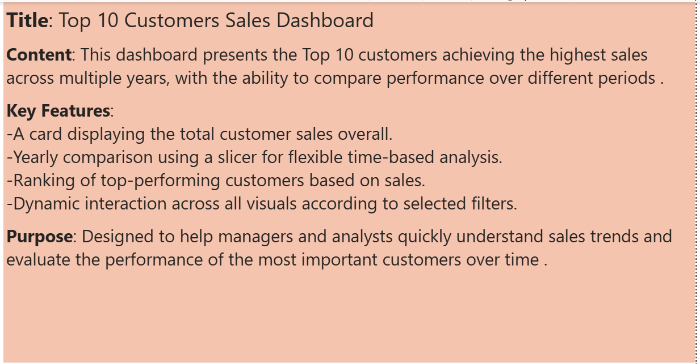

# Dashboards 

## 📌 Overview
This folder contains:
- **Power BI Dashboard File**: showing total customer sales across multiple years with interactive slicers and visuals.
- **SQL Query**: the script used to build the dashboard.
- **Dashboard Screenshot**:  a visual preview enabling quick understanding of the dashboard, eliminating the need to download the .pbix file.
- **File Screenshot**:A screenshot providing a descriptive overview of the Power BI dashboard content.

## 🎯 Purpose
To showcase the ability to:
- Connect SQL Server databases to Power BI.
- Build interactive dashboards for data visualization.

## 📊 Screenshots Of Dashboard 
- 
- 
- 

## 📂 Related Files
- [Download Power BI Dashboard File](../Dashboards/CustomerSales_MultiYear_Dashboard.pbix)  
- [View Query Used for Dashboard](../Dashboards/HighValue_Customers_Report_GroupBy.sql)
