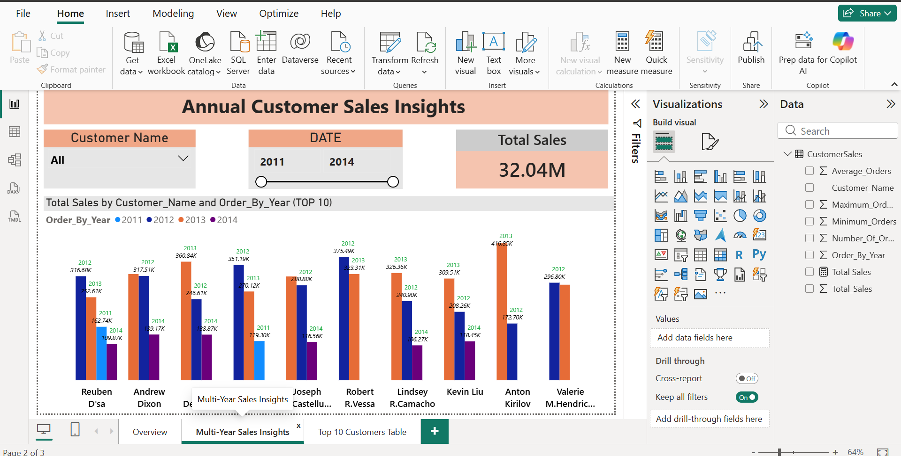
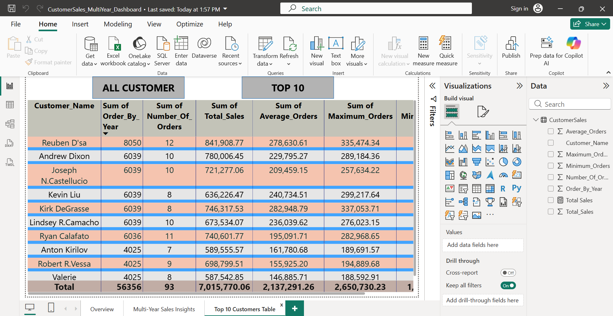

# Dashboards 

## 📌 Overview
This folder contains:
- **Power BI Dashboard File**: showing total customer sales across multiple years with interactive slicers and visuals.
- **SQL Query**: the script used to build the dashboard.
- **Dashboard Screenshot**: a preview image to quickly understand the dashboard without opening the `.pbix` file.

## 🎯 Purpose
To showcase the ability to:
- Connect SQL Server databases to Power BI.
- Build interactive dashboards for data visualization.
- Document queries and workflows clearly for recruiters.

## 📊 Screenshots Of Dashboard 
- 
- 

## 📂 Related Files
- [Open Power BI Dashboard File](../Dashboards/CustomerSales_MultiYear_Dashboard.pbix)  
- [View Query Used for Dashboard](../Dashboards/HighValue_Customers_Report_GroupBy.sql)
